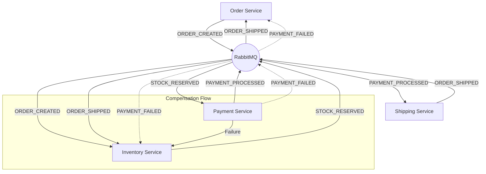
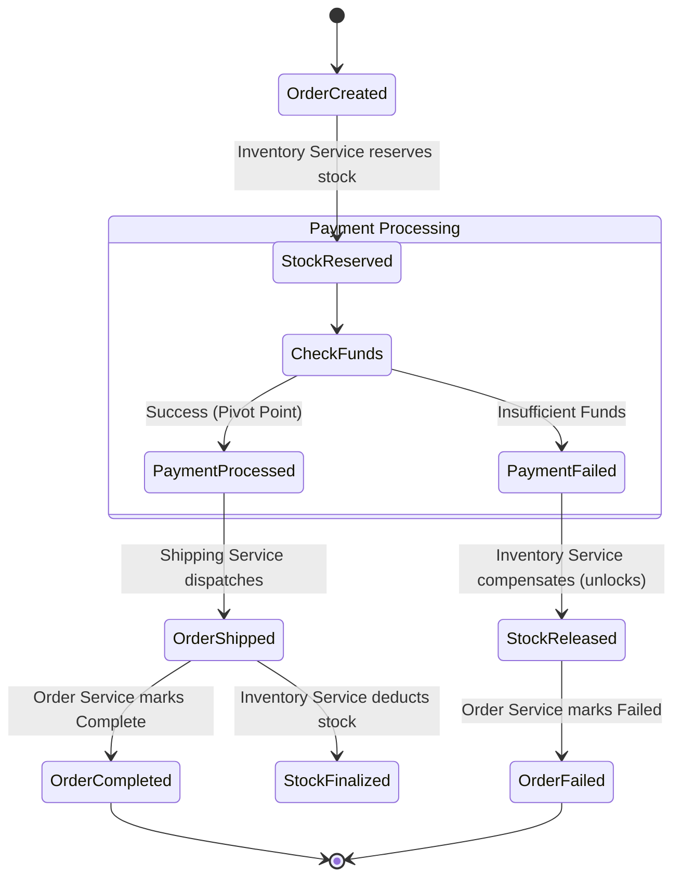

# SAGA Pattern (Choreography)

This project demonstrates the **SAGA Pattern** using a **Choreography-based** approach. In this architecture, there is no central orchestrator; instead, each service listens for events and decides what action to take, creating a decentralized workflow.

## 🏗️ Architecture

The system consists of four microservices that communicate asynchronously via RabbitMQ.

- **Order Service**: Initiates the order and tracks the final status.
- **Inventory Service**: Manages stock reservation (locking), compensation (unlocking), and finalization (deduction).
- **Payment Service**: Charges the customer. This serves as the **Pivot Transaction**—once this succeeds, the system attempts **Forward Recovery** (retrying until success) for subsequent steps.
- **Shipping Service**: Handles delivery. If this fails (after payment), it retries indefinitely (Forward Recovery) rather than rolling back.

### System Flow



## 🔄 State Machine & Events

The workflow follows a strict path of events. It handles both the **Happy Path** and **Failure Scenarios** (Compensation).



## 🚀 Key Concepts Implemented

1. **Choreography**: No central coordinator; logic is distributed.
2. **Pivot Transaction**: The Payment step is the "point of no return".
   - **Before Pivot**: If it fails, we trigger **Compensation** (Rollback) to undo previous steps.
   - **After Pivot**: If it fails (e.g., Shipping), we use **Forward Recovery** (Retry) because the user has already paid.
3. **Idempotency**: Every consumer checks if it has already processed a message to prevent duplicate side effects.
4. **Compensation**: If Payment fails, `InventoryService` listens to `PAYMENT_FAILED` to release the reserved stock.

## 🏃 How to Run

1. Ensure RabbitMQ is running (or update `infrastructure/config.js`).
2. Install dependencies:
   ```bash
   npm install
   ```
3. Run the simulation:
   ```bash
   node main.js
   ```

## 📂 Project Structure

- `services/`: Contains the logic for Order, Inventory, Payment, and Shipping.
- `infrastructure/`: RabbitMQ Broker wrapper and Mock Database.
- `main.js`: Bootstraps the services and triggers test orders.
