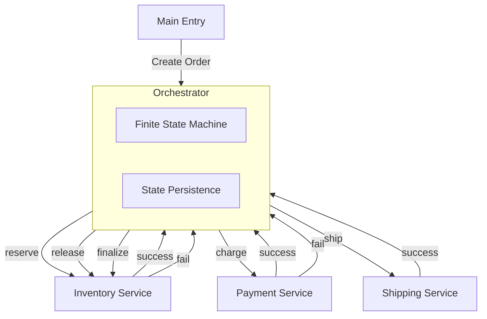
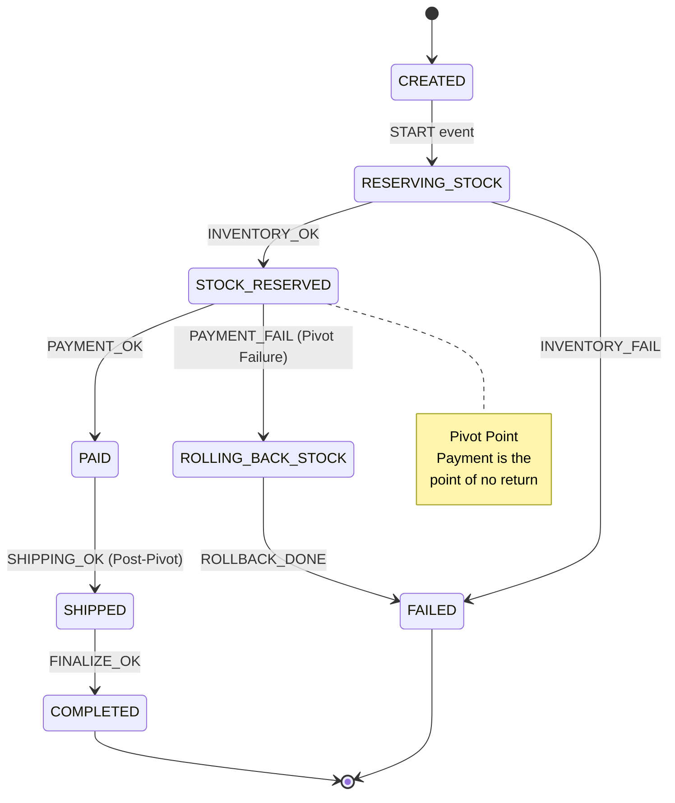

# SAGA Pattern (Orchestration)

This project demonstrates the **SAGA Pattern** using an **Orchestration-based** approach with a **Finite State Machine (FSM)**. In this architecture, a central orchestrator manages the entire workflow, making all decisions and coordinating service calls.

## 🏗️ Architecture

The system consists of:

- **Order Orchestrator**: The central brain that manages the entire workflow using a Finite State Machine
- **Inventory Service**: Responds to direct calls for stock reservation, release, and finalization
- **Payment Service**: Handles payment processing (the **Pivot Transaction**)
- **Shipping Service**: Handles delivery with internal retry logic (post-pivot)

Unlike Choreography, there is **no message broker**. Services communicate via direct method calls (simulating RPC/HTTP).

### System Flow



## 🔄 State Machine & Events

The orchestrator uses a **Finite State Machine** to manage workflow state. The workflow follows a strict path of state transitions, handling both the **Happy Path** and **Failure Scenarios** (Compensation).



## 🚀 Key Concepts Implemented

1. **Orchestration**: Centralized control in the Orchestrator; all workflow logic in one place.
2. **Finite State Machine (FSM)**: States, transitions, and guards are explicitly defined in the `transitions` getter, making the entire workflow visible and easy to understand.
3. **Unified Execution**: Single `execute()` method that automatically determines what to do based on current state. Works for both new orders (CREATED) and crash recovery (any state).
4. **State-Action Mapping**: Centralized `stateActionMap` ensures consistency between FSM transitions and crash recovery. Each state has an associated action that executes when entering that state.
5. **State Persistence**: Before executing any action, the orchestrator persists the new state to the database, enabling crash recovery (Zombie Saga handling).
6. **Pivot Transaction**: The Payment step is the "point of no return".
   - **Before Pivot**: If it fails, we trigger **Backward Recovery** (Compensation) to undo previous steps.
   - **After Pivot**: If it fails (e.g., Shipping), we use **Forward Recovery** (Retry) because the user has already paid.
7. **RPC/HTTP Simulation**: Services communicate via direct method calls instead of message broker events, simulating RPC/HTTP in a real microservices architecture.

## 🏃 How to Run

1. Install dependencies:
   ```bash
   npm install
   ```
2. Run the simulation:
   ```bash
   cd orchestration-based
   node main.js
   ```

## 📂 Project Structure

- `OrderOrchestrator.js`: Core FSM orchestrator that manages the workflow
- `constants.js`: Centralized constants for states and events (prevents typos, enables autocomplete)
- `services/`: Contains Inventory, Payment, and Shipping services that respond to direct calls
- `infrastructure/`: Mock Database with state persistence
- `main.js`: Bootstraps the orchestrator and triggers test orders
